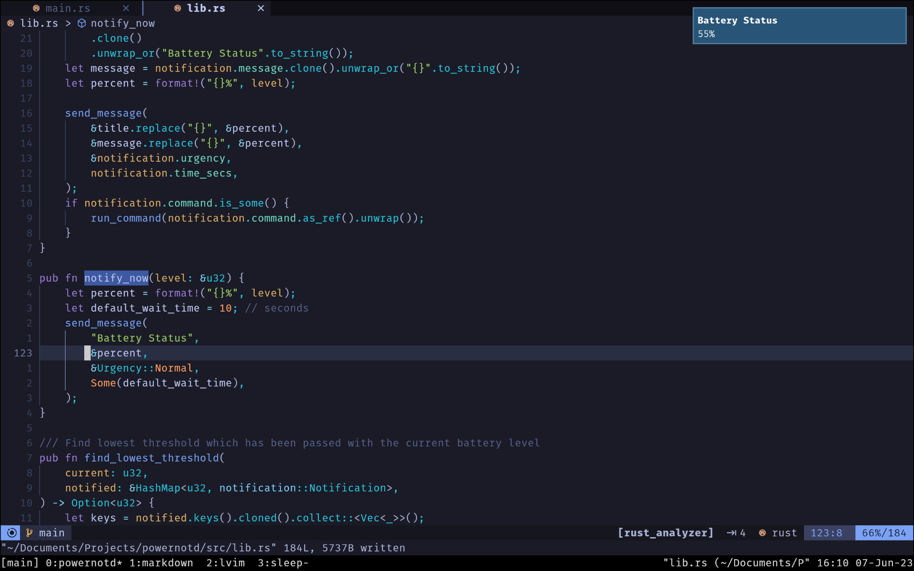

# Powernotd

Powernotd is a small battery-level desktop notification daemon for Linux/Unix written in Rust.



Powernotd sends desktop notifications according to the ['Desktop Notification Standard](https://specifications.freedesktop.org/notification-spec/notification-spec-latest.html)
which the system will present to the user graphically usually in the form of a small toast depending on your operating system.
Powernotd checks your battery-level and emits notifications in case they reach certain thresholds. It is only responsible for sending events
and your system will need some kind of notification display daemon which displays and renders the notification on your system.

If you use a desktop environment such a notification display daemon will be usually included. If not for example [mako](https://github.com/emersion/mako)
or [dunst](https://github.com/dunst-project/dunst) are popular choices.

Powernotd can be configured with a configuration file. See the [](#configuration-file) section.

The current battery-level is read from `/sys/class/power_supply/BAT0/capacity` which is a file written to by the operating system's power management.
This file is polled every minute and the battery-level is compared with the threshold values to see if a notification has to be sent.

This project was created to learn Rust and I needed desktop notifications after switching to the Arch operating system with the Hyprland display manager.

## Who may use this
If you use a minimal linux distribution and you do not have a full desktop environment configured but you use only a window manager such as
i3, awesome, bspwm, hyprland, sway, ...
A desktop environment usually has some kind of battery notification service integrated whereas a window manager usually doesn't.
When I switched to Arch using Hyprland I needed such a notification service and therefore created this project.

## Prerequisites

For powernotd to work you will need a Linux/Unix operating system that has the following files present:
* `/sys/class/power_supply/BAT0/capacity` -> contains the current battery-level, a file maintained by your os power management
* `/sys/class/power_supply/BAT0/status` -> contains the state such as 'Charging', 'Discharging', 'Full', ...
* follows the ['Desktop Notification Standard](https://specifications.freedesktop.org/notification-spec/notification-spec-latest.html)
* You have a display notification daemon installed which renders the notifications such as [mako](https://github.com/emersion/mako)
or [dunst](https://github.com/dunst-project/dunst)

## Installation

### Aur (Arch user repository)

If you are on an arch linux based distribution you can install it from the [aur](https://aur.archlinux.org/packages/powernotd-bin)
using any kind of aur-helper.
For example
`yay -S powernotd` or `paru -S powernotd`

### From Binaries

Binaries are provided in the [releases section](https://github.com/Laeri/powernotd/releases)

### Cargo crate install 

`cargo install powernotd`

Make sure your `$PATH` variable contains `$HOME/.cargo/bin/` as cargo installs it's binaries there.

## Usage

If you have installed powernotd you can run it without any arguments and the service will notify when the battery-level falls below a threshold.
You can start powernotd in the background on boot manually or use a Systemd service file provided in the [releases section](https://github.com/Laeri/powernotd/release`
or in the source code within the `systemd` folder. If you use a package type that also includes the Systemd service it will already
be copied to the correct location and you can directly enable and start the service.

Copy the service file into `/etc/systemd/system/`, `~/.local/share/systemd/user/` or `~/.config/systemd/user/`.

Enable and start the service `systemctl enable --now powernotd.service`.
Check the service status with `systemctl status powernotd.service`.

### Command-line interface

Man page entry which is also included in the release:

```
Powernotd is a battery-level notification daemon that sends notification using the xdg desktop notification standard.

Usage: powernotd [OPTIONS]

Options:
  -s, --status-level               Print the current battery-level to stdout then exit
  -c, --charging-state             Print charging status 'charging', 'discharging', 'full' or 'unknown' to stdout then exit
  -f, --config-file <CONFIG_FILE>  Set config-file path if needed, otherwise $XDG_CONFIG_HOME/powernotd/config.json is used
  -n, --notify-now                 Send desktop notification with current battery-level then exit
  -t, --list-thresholds            List all notification thresholds in the format 'a_1%, a_2%, ..., a_n%' that are specified in the config-file
  -p, --show-config-path           Display the path to the config-file
  -b, --battery <BATTERY>          Pass the battery such as 'BAT1' if your system has multiple and you do not want to use the default (BAT0). Check '/sys/class/power_supply/' to see which batteries you have
  -h, --help                       Print help
  -V, --version                    Print version
```

### Configuration file

Powernotd follows the ['XDG Base Directory Specification'](https://specifications.freedesktop.org/basedir-spec/basedir-spec-latest.html), see also the [arch wiki entry](https://wiki.archlinux.org/title/XDG_Base_Directory).
This means that if you have an environment variable named `XDG_CONFIG_HOME` specified, a configuration file will be created in the path:
`XDG_CONFIG_HOME/powernotd/config.json`. If this environment variable is not present the configuration file will be created in the path:
`~/.config/powernotd/config.json`.
If you want to run powernotd with a custom configuration file use the `-f` or `--config-file` flag and provide your own path.

The configuration file is Json and the following is the annotated default configuration.
Each entry in the `notifications` array contains a threshold for which a notification should be sent if the current power level drops
beneath the threshold.

See the full default config file for some example values: 

Single entry for a notification threshold within the notifications array:
```
      level:        number, this is the threshold and a notification will be sent if the power drops below this level

      urgency:      string, one of "Low", "Normal", "Critical". 
                    This is the urgency of the desktop notification standard and your 
                    notification display daemon might render them in different colors based on the urgency 

      time_secs:    number, optional, how long the notification should stay active in seconds. 
                    If given it is passed along in the notification event, otherwise no time is passed and your 
                    notification display daemon will decide how long the notification stays active.

      title:        string, title which will be displayed in the message, you can provide any string template. 
                    If it contains '{}', the current power level will be inserted at this location 
                    
      message:      string, message that will be displayed below the title. Also can contain '{}' and 
                    the current power level will be inserted.
      command:      string, optional, if you want to run a specific command if the threshold is reached 
                    it can be given here as a string.
```

Additionally, apart from the `notifications` array the config-file also has an entry for a notification that will be sent when the
battery is fully charged.:

```
full_notification

    urgency: same as notification urgency, one of "Low", "Normal", "Critical"
    enabled: boolean, if set to false then no notification will be shown when fully charged
    title: string, same as notification title but no level will be inserted in the template
    message": string // same as notification message but no level will be inserted in the template
  
```


Full default configuration file:
```json
{
  "notifications": [
    {
      "level": 30,
      "urgency": "Low",
      "title": "Battery Status",
      "message": "{}%"
    },
    {
      "level": 20,
      "urgency": "Normal",
      "title": "Battery Status",
      "message": "{}%"
    },
    {
      "level": 15,
      "urgency": "Critical",
      "time_secs": 10000,
      "title": "Battery Status",
      "message": "{}%"
    },
    {
      "level": 10,
      "urgency": "Critical",
      "time_secs": 10000,
      "title": "Battery Status",
      "message": "{}%"
    },
    {
      "level": 5,
      "urgency": "Critical",
      "time_secs": 10000,
      "title": "Critical Battery Status",
      "message": "{}%"
    },
    {
      "level": 2,
      "urgency": "Critical",
      "time_secs": 10000,
      "title": "Critical Battery Status",
      "message": "{}%"
    },
    {
      "level": 1,
      "urgency": "Critical",
      "time_secs": 10000,
      "title": "Critical Battery Status",
      "message": "{}%"
    }
  ],
  "full_notification": {
    "urgency": "Low",
    "enabled": true,
    "title": "Battery Status",
    "message": "Fully Charged 100%"
  }
}
```

## License

Distributed under the MIT License. See `LICENSE` for more information.
